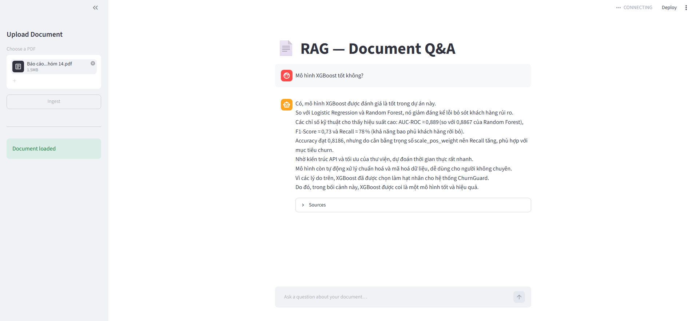
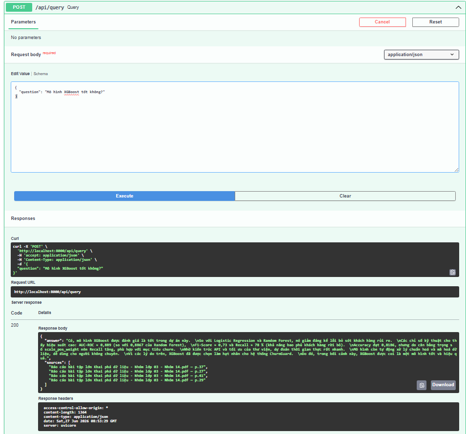
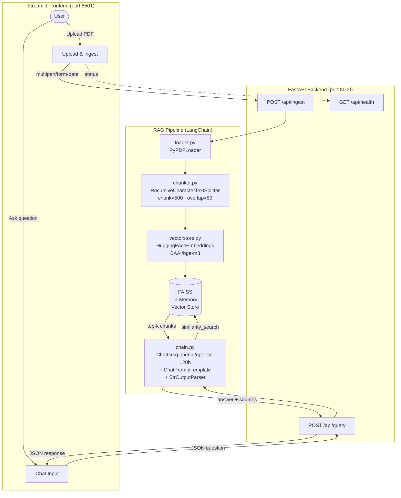
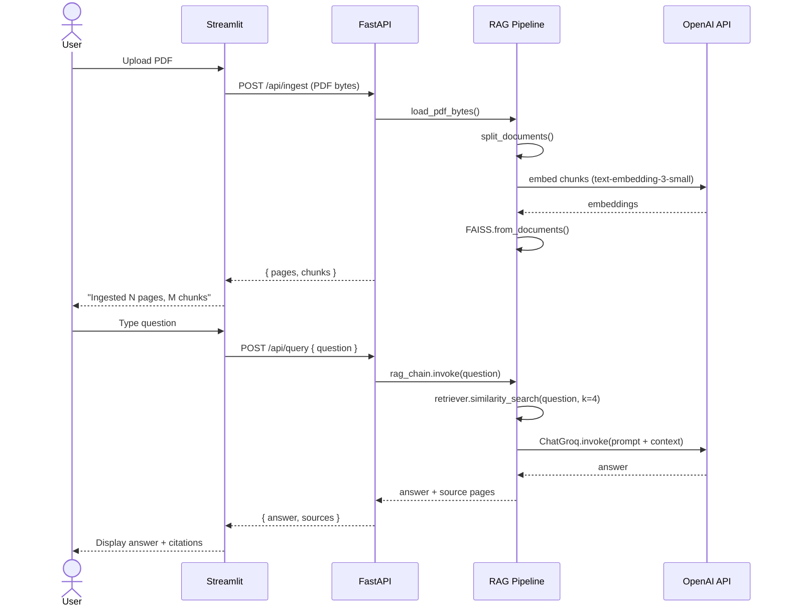

# RAG — PDF Question-Answering System

A modular Retrieval-Augmented Generation (RAG) pipeline built with **LangChain**, served via a **FastAPI** backend and a **Streamlit** chat interface.


## Demo

### Streamlit 


### API (FastAPI)



## Architecture




## Request / Response Flow




## Project Structure

```
RAG/
├── main.py                  # FastAPI entry point
├── pyproject.toml
├── .env                     # GROQ_API_KEY goes here
│
├── app/
│   ├── config.py            # Centralised settings (model names, chunk sizes)
│   ├── api/
│   │   └── routes.py        # /ingest · /query · /health endpoints
│   └── rag/
│       ├── loader.py        # PDF loading (PyPDFLoader)
│       ├── chunker.py       # Text splitting
│       ├── vectorstore.py   # FAISS build + retriever
│       └── chain.py         # Prompt template + LLM + output parser
│
└── frontend/
    └── app.py               # Streamlit chat UI
```


## Prerequisites

- Python ≥ 3.11
- An Groq API key
- UV package manager


## Setup

### 1 — Clone project

```bash
git clone 
```

### 2 — Create and activate a virtual environment

```bash
python -m venv .venv       
Windows: .venv\Scripts\activate
```

### 3 — Install dependencies

```bash
uv sync
```

### 4 — Set your Groq API key

```bash
cp .env.example .env
# then open .env and replace sk-your-key-here with your real key
```


## Running the Application

Open **two terminals** from the project root (both with the venv activated).

### Terminal 1 — Backend (FastAPI)

```bash
.venv\Scripts\activate
uvicorn main:app --host 0.0.0.0 --port 8000 --reload
```

Interactive API docs → http://localhost:8000/docs

### Terminal 2 — Frontend (Streamlit)

```bash
.venv\Scripts\activate
streamlit run frontend/app.py
```

UI → http://localhost:8501


## Usage

1. Open **http://localhost:8501** in your browser.
2. Use the **sidebar** to upload a PDF and click **Ingest**.
3. Wait for the confirmation ("Ingested N pages, M chunks").
4. Type a question in the chat box and press **Enter**.
5. The answer appears with cited source pages.


## Configuration

All tuneable parameters live in [`app/config.py`](app/config.py):

| Variable | Default | Description |
|---|---|---|
| `LLM_MODEL` | `openai/gpt-oss-120b` | OpenAI chat model |
| `EMBEDDING_MODEL` | `BAAI/bge-m3` | Hugging Face Embeddings model |
| `CHUNK_SIZE` | `500` | Characters per chunk |
| `CHUNK_OVERLAP` | `50` | Overlap between chunks |
| `RETRIEVER_K` | `4` | Top-k chunks returned per query |


## API Reference

| Method | Endpoint | Description |
|---|---|---|
| `GET` | `/api/health` | Backend status + document-loaded flag |
| `POST` | `/api/ingest` | Upload PDF (`multipart/form-data`, field: `file`) |
| `POST` | `/api/query` | Ask a question (`{ "question": "..." }`) |

## Author

**Dang Nguyen** — [GitHub](https://github.com/okarinn06)

Collaborate with me if you wish.

## License

GPLv3 - see [LICENSE](LICENSE).


